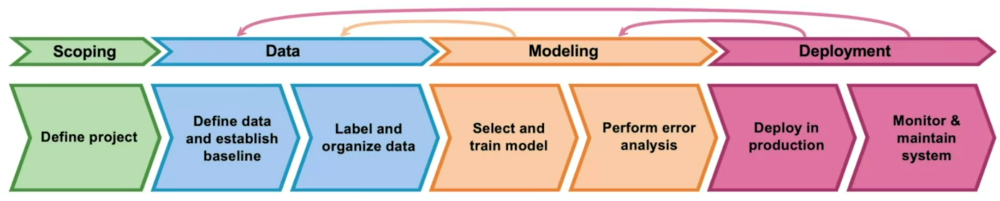
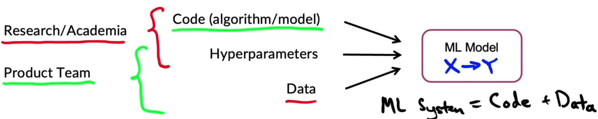
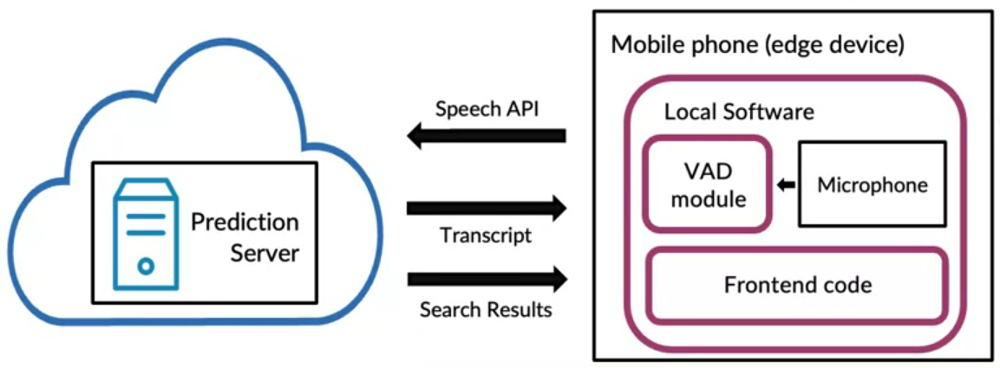
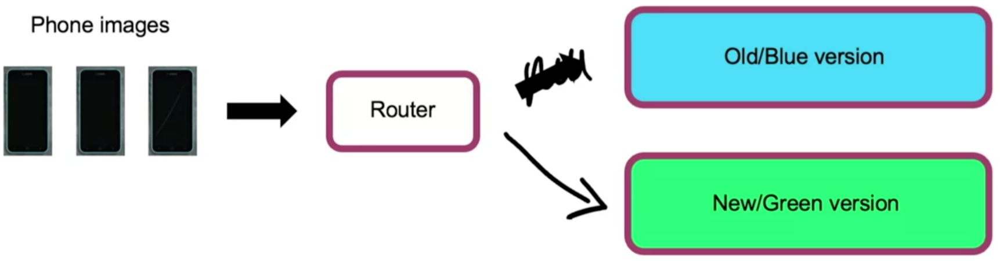
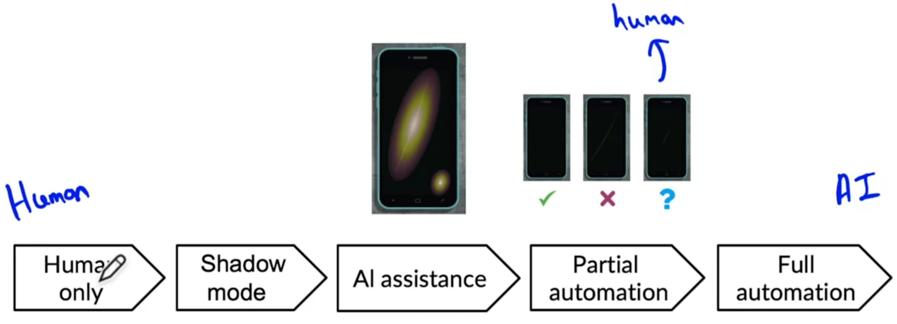
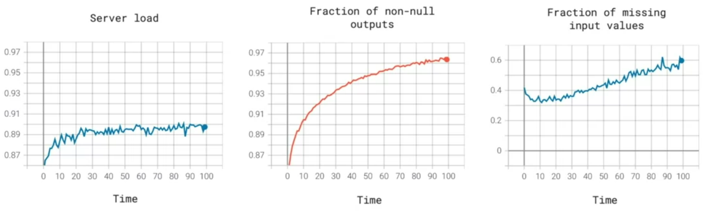
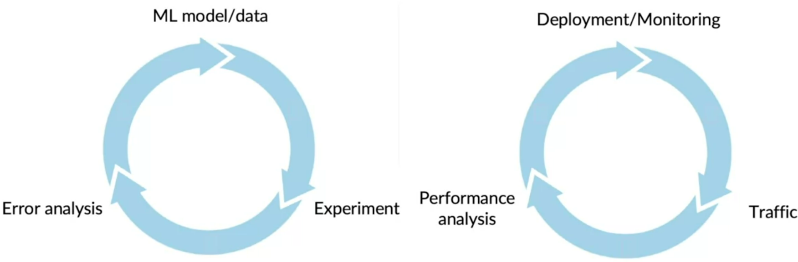
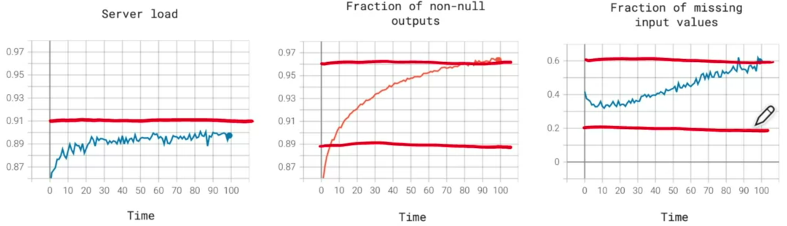

# Course 1 Week 1: Overview of the ML Lifecycle and Deployment 

## The Machine Learning Project Lifecycle

### Steps of an ML Project

- Scoping: in which you have to define the project or decide what to work on. What exactly do you want to apply Machine Learning to, and what is X and what is Y.
- Data:
    - Defining the data and establishing a baseline.
    - Label and organize data.
- Modeling:
    - Select and train the model.
    - Perform error analysis.
- Deployment:
    - Deploy in production.
    - Monitor and maintain the system.

### Case study: speech recognition

#### Scoping stage

- Decide to work on speech recognition for voice search
- Decide on key metrics:
    - Accuracy, latency, throughput...
- Estimate resources and timeline.

#### Data stage

Define data:
- Is the data labeled consistently?
- How much silence before/after each clip?
- How to perform volume normalization?

#### Modeling

- In research/academia work, you tend to keep the data fixed and vary the code and hyperparameters.
- in product teams, it can be more effective to keep the code fixed and vary the data

#### Deployment stage

Example of architecture for speech recognition product.

 
After deploying, you still need to monitor the model.
- Concept drift
- Data drift

## Deployment

### Key challenges

#### Concept drift and Data drift

What if your data changes after your system have already been deployed? 

*Data drift* is used to describe if the input (X) distribution has changed. *Concept drift* is used to describe if the mapping (X->y) has changed.

**Speech recognition example:**

Training set:
- Purchased data, historical user data with transcripts.

Test set:
- Data from a few months ago.

How has the data changed?
- Gradual change: language change
- Sudden shock: COVID-19

#### Software engineering issues

Checklist:
- Real-time or batch prediction?
- Cloud vs. Edge
- Computer resources (CPU, GPU, memory)
- Latency, throughput (QPS)
- Logging
- Security and privacy 

### Deployment patterns

#### Common deployment cases

1. New product/capability
2. Automate/assist with manual task
3. Replace the previous ML system

Key ideas:
- Gradual ramp up with monitoring
- Rollback

#### Visual inspection example - Shadow Mode pattern

ML system shadows the human and runs in parallel.

ML system's output not used for any decision during this phase

#### Canary deployment

- Roll out to a small fraction (say 5%) of traffic initially.
- Monitor system and ramp up traffic gradually.

#### Blue green deployment

Blue (old prediction service), green (new prediction service), and the router switch the traffic from the old to the new one.

- Easy way to enable rollback

#### Degrees of automation

You can choose to stop before getting to full automation.

### Monitoring

#### Monitoring dahboard

- Brainstorm the things that could go wrong.
- Brainstorm a few statistics/metrics that will detect the problem.
- It is ok to use many metrics initially and gradually remove the ones you find not useful.

#### Examples of metrics to track

- Software metrics:
    - Memory
    - CPU
    - Latency
    - Throughput
    - Server load
- Input metrics
    - Average input length
    - Average input volume
    - Number of missing values
    - Average image brightness
- Output metrics
    - Number of times it returns null
    - Number of times user redoes search
    - Number of times user switches to typing (voice recognition)

#### Just as ML modeling is iterative, so is the deployment

An iterative process to choose the right set of metrics to monitor.

#### Monitoring dahboard

- Set thresholds for alarms
- Adapt metrics and thresholds over time

#### Model maintenance

- **Manual retraining:** an engineering train a new model, performs error analysis, and pushes it to deployment.
- **Automatic retraining** 

### Pipeline monitoring

Many AI systems are not just a single machine learning model running a prediction service, but instead involves a  pipeline of multiple steps. Changes in one step may affect the next steps.

Metrics to monitor:
* Software metrics
* Input metrics
* Output metrics

**How quickly data change?** Some applications have data that changes quickly. User data generally has a slower drift. Enterprise data (B2B) can shift fast.

### Optional references

[Concept and Data Drift](https://towardsdatascience.com/machine-learning-in-production-why-you-should-care-about-data-and-concept-drift-d96d0bc907fb)

[Monitoring ML Models](https://christophergs.com/machine%20learning/2020/03/14/how-to-monitor-machine-learning-models/)

[A Chat with Andrew on MLOps: From Model-centric to Data-centric](https://www.youtube.com/watch?v=06-AZXmwHjo)

#### Papers

Konstantinos, Katsiapis, Karmarkar, A., Altay, A., Zaks, A., Polyzotis, N., … Li, Z. (2020). Towards ML Engineering: A brief history of TensorFlow Extended (TFX). http://arxiv.org/abs/2010.02013 

Paleyes, A., Urma, R.-G., & Lawrence, N. D. (2020). Challenges in deploying machine learning: A survey of case studies. http://arxiv.org/abs/2011.09926

Sculley, D., Holt, G., Golovin, D., Davydov, E., & Phillips, T. (n.d.). Hidden technical debt in machine learning systems. Retrieved April 28, 2021, from Nips.c https://papers.nips.cc/paper/2015/file/86df7dcfd896fcaf2674f757a2463eba-Paper.pdf