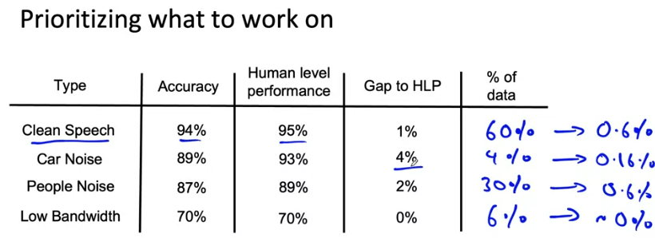
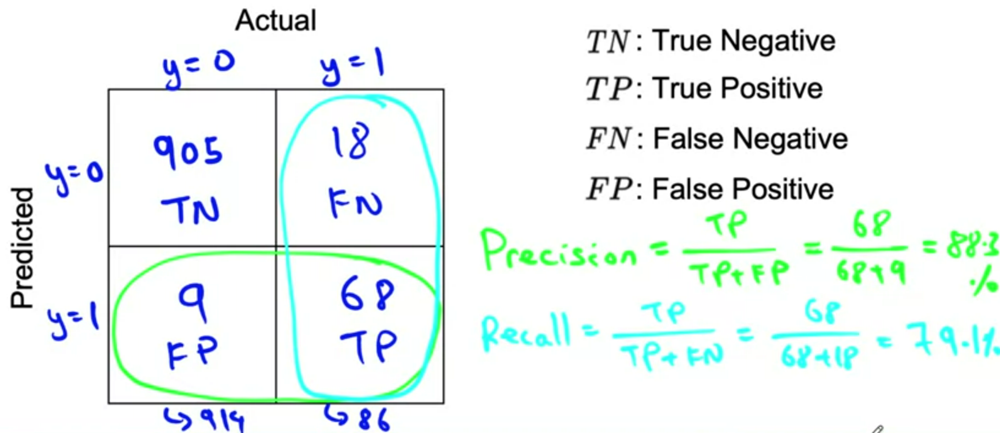
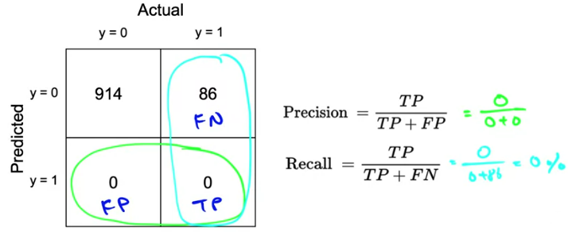
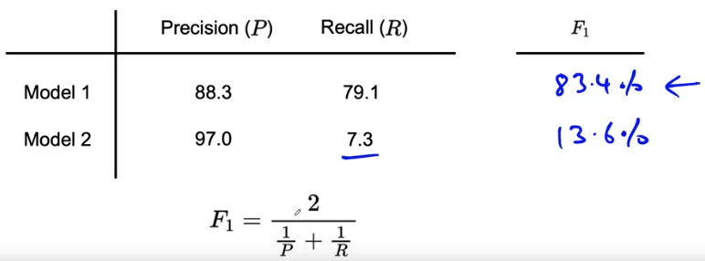
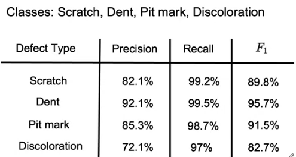
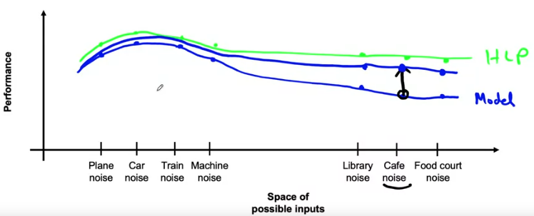
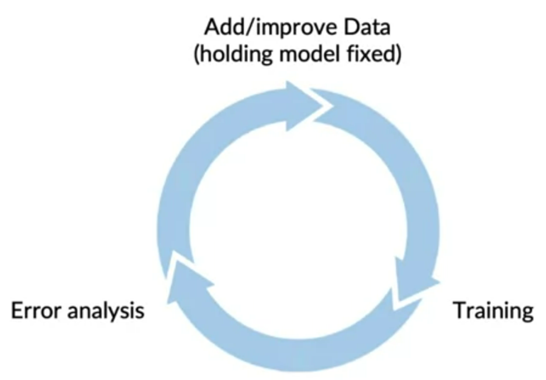
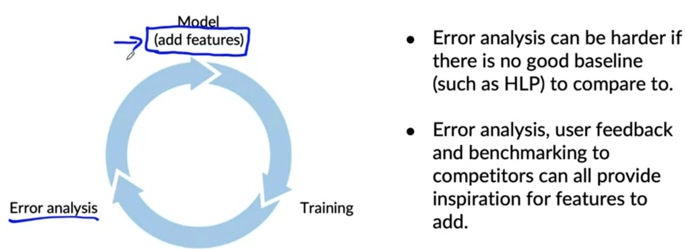

# Week 2: Model overview

## Selecting and Training a Model

### Modeling overview

**Model-centric AI development vs Data-centric AI development**: there has been a lot of emphasis on choosing the right model, such as the right neural network architecture. For practical projects, it may be more useful to take a data-centric approach, making sure you are feeding your algorithm with high-quality data.

### Key challenges

AI system = Code (algorithm/model) + Data

Model development is an iterative process, going through iteration fast is key to improve performance. By the end, carry out a richer error analysis (audit performance)

Challenges in model development:
- Doing well on the training set
- Doing well on the dev/test set
- Doing well on business metric or project goal

### Why low average error isn't good enough

Challenges:
- Performance on disproportionately important examples
    - Give a higher weight
- Performance on key slices of the dataset
    - **Loan approval:** make sure not to discriminate by etnicity, gender, location...
    - **Product recommendations from retailers:** be careful to treat fairly all major user, retailer, and product categories.
- Rare classes
    - **Skewed data distributon:** accuracy in rare classes, e.g. medical diagnosis

### Establish a baseline

#### HLP: Human level performance

**Speech recognition:** 
- Clear speech: 94% (95% HLP)
- Car noise: 89% (93% HLP)
- People noise: 87% (87% HLP)
- Low bandwitch: 70% (70% HLP)

Focus on car noise background.

#### Unstructured and structured data

Humans are better at unstructured data

- **Unstructured data:** use HLP as baseline
- **Structured data** (giant databases): HLP is less usefull

#### Ways to stablish a baseline

- HLP
- Literature
- Quick-dirty-implementation
- Performance of older system

Baseline helps to indicate what might be possible. In some cases it also gives a sense of what is irreducible error.

### Tips for getting started

#### Model + Hyperparameters + Data

- Literature search to ee what's possible (courses, blogs, projects)
- Find open-source implementations
- Reasonable algorithm + good data > great algorithm with + not so good data

#### Deployment constraints

Should you take into account deployment constraints when picking a model? 
- **Yes**,, if baseline is already established and goal is to build and deploy.
- **No** (or not necessarily), if purpose is to *establish a baseline* and determine what is possible and might be worth pursuing.

#### Sanity-check for code and algorithm

- Try to overfit a small training dataset before training on a large one to find bugs quickly.
    - Example 1: speech recognition - train on only one example
    - Example 2: image segmentation - feed just one image

## Error analysis and performance auditing

The heart of the machine learning development process as error analysis, which if you do it well, It can tell you what's the most efficient use of your time in terms of what you should do to improve your learning albums performance. 

### Error analysis example

**Speech recognition example:** evaluate if the misprediction has car noise or people noise in a spreadsheet. Maybe in the process you can come up with new columns. (manual process)

**Automatic process:** such as landing lens for visual applications.

**Also a iterative process:** examine/tag examples <-> propose tags 

**Useful metrics for each tag:**
- What fraction of errors has that tag
- Of all data with that tag, what fraction is misclassified?
- What fraction of all the data has that tag?
- How much room for improvement is there on data with that tag?

### Prioritizing what to work on

Prioritizing certain type may give better improvement in performance, e.g. improving clean speech and people noise recognition can improve the overall performance by 0.6% each.

Decide based on:
- How much room for improvement there is
- How frequently that category appearrs
- How easy is to improve accuracy in that category (e.g. using data augmentation)
- How important it is to improve performance in that category

Adding/improving data for a specific category:
- Collect more data
- Use data augmentation
- Improve label accuracy/data quality

### Skewed datasets

Data sets where the ratio of positive to negative examples is very far from 50-50.

**Manufacturing**: 99.7% no defect, 0.3% defect
**Medical diagnosis**: 99% of patients don't have the disease
**Speech recognition**: in wake word detection (e.g. ok google), 96,7% of the time wake word doesn't occur

**Raw accuracy is not a useful metric.**

#### Confusion matrix

What happens with print('0')?

We get 0% precision and 0% recall

#### F1-score: combines precision and recall

F1-score is a way of combining precision and recall that emphasizes whichever precision or recall is worse (harmonic mean).

#### Multi-class metrics

In multiclass problems, you can evaluate precision, recall, and F1-score for each class, allowing you to prioritize what to work on next.

### Performance auditing

Even when you're learning algorithm is doing well on accuracy or F1-score is often worth one last performance audit before you push it to production.

#### Auditing framework

1. Brainstorm the ways the system might go wrong
    - Performance on subsets of data (ethnicity, gender)
    - How common are certain errors (e.g., FP, FN)
    - Performance on rare classes
2. Establish metrics to assess the algorithm's performance on these issues on appropriate *slices of data*
3. Get business/product owner buy-in

#### Speech recognition example

1. Brainstorm the ways the system might go wrong
    - Accuracy on different genders and ethnicities
    - Accuracy on different devices
    - Prevalence of rude mis-transcriptions (e.g., GAN transcripted as *gun* or *gang*)
2. Establish metrics to assess the algorithm's performance on these issues on appropriate *slices of data*
    - Mean accuracy for different genders and mmajor accents
    - Mean accuracy on different devices
    - Check for prevalence of offensive words in the output

#### One last advice

Rather than just one person try to brainstorm what may go wrong for high stakes applications you can have a team or external advisers help you brainstorm things you want to watch out for.

## Data iteration

### Data-centric AI development

Let's say that era analysis has caused you to decide to focus on improving your outcome learning performance on data with a certain audio tag, say speech with car noise in the background.

#### Model centric view

Take the data you have, and develop a model that does as well as possible on it. Hold the data fixed and iteratively improve the code/model.

#### Data-centric view

The quality of the data is paramount. Use tools to improve the data quality; this will allow multiple models to do well. *Hold the code fixed and iteratively improve the data.*

### A useful picture of data augmentation

#### Speech recognition example

Different types of speech input.

By augmenting the data with cafe noise, one can pull up the performance on inputs on this type of noise. Pulling up one point cause nearby points to be pulled up more than far away points.

### Data augmentation

Data augmentation can be a very efficient way to get more data, especially for unstructured data problems such as images, audio, maybe text. 

**Speech recognition example**: adding cafe or music noise to speech.

**Goal:** create *realistic examples* that (i) the algorithm does poorly on, but (ii) humans (or other baseline) do well on.

**Checklist:**
- Does it sound realistic?
- Is the x -> y clear (e.g. can human recognize speech?)
- Is the algorithm currently doing poorly on it?

**Image example:** flip picture, change contrast, photoshop scratches, GANs, darkening. *Note:* generating a image that is too dark may not be useful.

**Data iteration loop:**

### Can adding data hurt?

For a lot of machine learning problems, training sets and
dev and test set distribution start at being similar. But, if you're using data augmentation, you're adding to specific parts of the training set such as adding lots of data with cafe noise. So now you're training set may come from a very different distribution than the dev set and the test set. 

**Is this going to hurt your learning algorithm's performance?**

For unstructured data, if:
- The model is large (low bias)
- The mapping x -> y is clear (humans can make accurate predictions)

Then, **adding data rarely hurts accuracy.**

**Photo OCR counterexample**

Adding a lot of new "I"s may skew the dataset and hurt performance.

### Adding features

For many structure data problems, creating new training examples is difficult, but there's something else you could do which is to take existing training examples and figure out if there are additional useful features you can add to it.

#### Structured data

**Restaurant recommendation** example:

Vegetarians are frequently recommended restaurants with only meat options.

Possible features to add?
- Is person vegetarian (based on past orders)?
- Does this restaurant have vegetarian options (based on menu)?

**Other food delivery examples:**
- Users only order tea/coffee
- Users only order pizza

There's a trend in product recommendation switching from **collaborative filtering** (recommends things people like you also liked) to **content based filtering** (look at you and the restaurant to see if the restaurant is a good match. Content based filtering is useful, for instance, for recommending new restaurants that have no reviews. (cold start problem).

#### Data iteration

### Experiment tracking

When you're running dozens or hundreds or maybe even more experiments, it's easy to forget what experiments you have already run. Having a system for tracking
your experiments can help you be more efficient.

What to track?

- Algorithm/code versioning
- Dataset used
- Hyperparameters
- Results (metrics or trained modelss)

Tracking tools
- Text files (for small environments)
- Spreadsheet
- Experiment tracking systems (Weight&Biases,Comet, MLflow,Sage Maker Studio)

Desirable features
- Information needed to replicate results
- Experiment results with summary metrics/analysis
- Perhaps also resource monitoring, model visualization,model error analysis

### From big data to good data

Try to ensure consistently high-quality data in all phases of the ML project lifecycle.
- Covers important cases (x)
- Is defined consistently (y is unambiguous)
- Has timely feedback from production data
- Is sized appropriately

## Optional references

[Establishing a baseline](https://blog.ml.cmu.edu/2020/08/31/3-baselines/)

[Error analysis](https://techcommunity.microsoft.com/t5/azure-ai/responsible-machine-learning-with-error-analysis/ba-p/2141774)

[Experiment tracking](https://neptune.ai/blog/ml-experiment-tracking)

### Papers

Konstantinos, Katsiapis, Karmarkar, A., Altay, A., Zaks, A., Polyzotis, N., … Li, Z. (2020). Towards ML Engineering: A brief history of TensorFlow Extended (TFX). http://arxiv.org/abs/2010.02013 

Paleyes, A., Urma, R.-G., & Lawrence, N. D. (2020). Challenges in deploying machine learning: A survey of case studies. http://arxiv.org/abs/2011.09926

Sculley, D., Holt, G., Golovin, D., Davydov, E., & Phillips, T. (n.d.). Hidden technical debt in machine learning systems. Retrieved April 28, 2021, from Nips.c https://papers.nips.cc/paper/2015/file/86df7dcfd896fcaf2674f757a2463eba-Paper.pdf