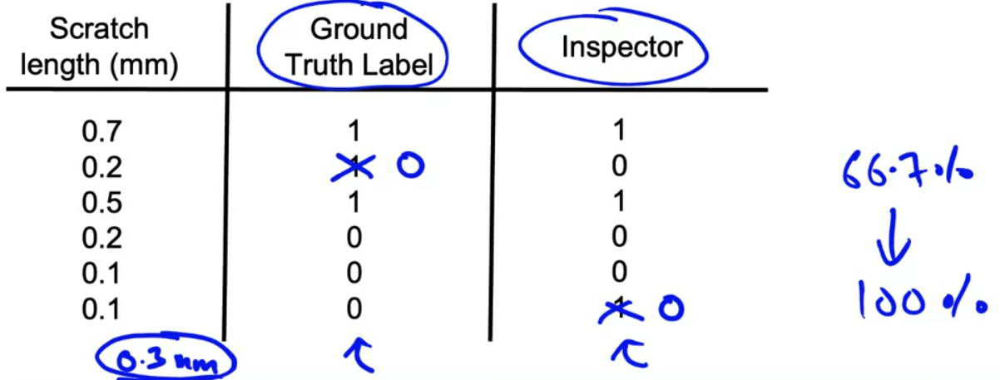
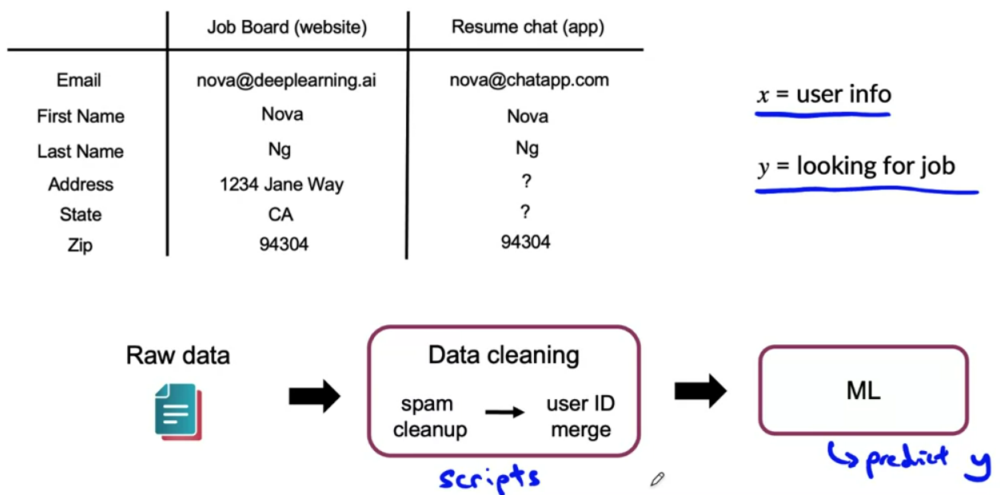
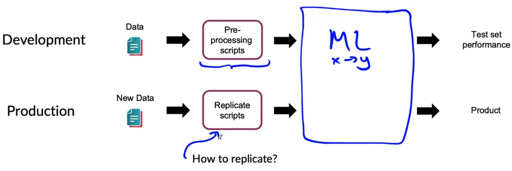
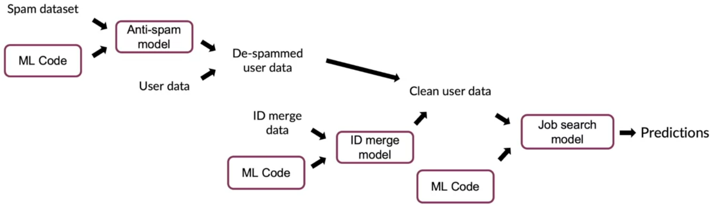

# Data Definition and Baseline

## Define Data and Establish Baseline 

### Why is data definition hard?

#### Detecting iguana example

Three people can come up with three different ways to label the iguanas.

#### Phone defect detection

#### Data stage

In this week, we will dive into best practices for the data stage of the machine learning project.

- How to define what is the data?
- How to label and organize the data well?

### More label ambiguity examples

#### Speech recognition example

An audio clip can be transcribed in different ways:
- "Um, nearest gas station"
- "Umm, nearest gas station"
- "Nearest gas station [unintelligible]"

#### User ID merge example

A common application in many companies is user ID merge, that's when you have multiple records that you think correspond to the same person.

Say you company acquires another company:

Two ways to merge the data:
- Use a supervised approach to say if two users are the same or not based on user attributes, in a scale of 0 to 1. Use instances labelled by users.
- Hire people to manually merge users. Give clear instructions.

#### Data definition questions

- What is the input x?
    - (Phone deffect detection) Is lightning good enough? Contrast? Resolution?
    - (Structured data) What features need to be included?
- What is the target label y?
    - How can we ensure labelers give consistent labels?

### Major types of data problems

The best practices for organizing data for one type can be quite different than the best practices for totally different types.

#### Major types of data problems

 

Unstructured data vs. structured data

- Unstructured data
    - May or may not have huge collection of unlabeled examples x
    - Humans can label more data
    - Data augmentation more likely to be helpful
- Structured data
    - May be more difficult to obtain more data
    - Human labeling may not be possible (with exceptions)

Small data vs. big data

- Small data
    - Clean labels arer critical
    - Can manually look through dataset and fix labels
    - Can get all the lbelers to talk to each other
- Big data
    - Emphasis on data process

### Small data and label consistency

In problems of a small dataset, having clean and consistent labels is especially important. 

When you have a small dataset, five examples and noisy label, it is hard to fit a function confidently. Now, if you have a ton of data, equally noisy as the small data, the learning algorithm can fit a function pretty confidently.

What if you have a small dataset, but clean and consistent labels? In this case, you can confidently fit a function.

#### Phone defect example

When labels are not consisteny, it may be fruitful to ask inspectors to reach an agreement. If the inspectors agree that the point of transition is a length of 0.3mm, it becomes easier to the learning algorithm to consistenly decide if something is a scratch.

#### Big data problems can have small data challenges too

Problems with a large dataset but where there is a *long tail* of rare events in the input will have small data challenges too.
- Web search (small data of rare queries)
- Self-driving cars (small data of rare occurrences)
- Product recommendation systems (small data of interactions with less popular products)

### Improving label consistency

- Have multiple labelers label same example.
- When there is disagreement, have MLE, subject matter expert (SME) and/or labelers discuss definition of _y_ to reach agreement (document that agreement and instructions).
- If labelers believe that x doesn't contain enough information, consider changing x.
- Iterate until it is hard to significantly increase agreement.

#### Standardize labels

Standardize:
- "Um, nearest gas station"
- "Umm, nearest gas station"
- "Nearest gas station"

into 
- "Um, nearest gas station"

#### Merge classes

If the definition of what is a deep or shallow scratch is unclear, merge the classes into a single scratch class. 

#### Have a class/label to capture uncertainty

Supose you ask labelers to label phones as defective or not based on the length of a scratch.

Reaching an agreement is a way to reduce label ambiguity. If that turns out difficult, another option is to create a new class, acknowledging if an example is ambiguous.

- **Defect:** 0, 1 or borderline

If it is possible to create consistent instructions for this three class problem, that could improve label consistency.

Another example is an audio with lots of noise, where it may be better to reach an agreement to label part of the text as [uninteligible].

#### Small data vs. big data (unstructured data)

Small data
- Usually small number of labelers
- You can ask labelers do discuss specific labels

Big data
- Get to consistent definition with a small group
- Then sending labeling instructions to labelers
- Consider using voting to reach a consensus between multiple labelers

In the current machine leaning scenario, there is a lack of tools for assisting labeling and label consistency between a team.

### Human level performance (HLP)

Some machine learning tasks consists of predicting an inherently ambiguous output, and human level performance (HLP) can establish a useful baseline of performance. But HLP is sometimes misuse.

#### Why measure MLP

Estimate bayes error/irreducible error to help with error analysis and prioritization.

If the ground truth label was written by another human, are we measuring what is possible or how well two people agree to each other? When the ground truth label is written by a person, there's a different approach to thinking about HLP.

#### Other uses of HLP

- In academia, establish and beat a respectable benchmark to supportr publication.
- Product owner asks for 99% accuracy. HLP helps establish a more reasonable target.
- "Prove" the ML system is superior to humans doing the job and thus the business or product owner should adopt it (**use with caution**).

#### The problem with beating HLP as a "proof" of ML "superiority"

- **Label 1:** "Um... nearest gas station" (70% of labelers)
- **Label 2:** "Um, nearest gas station" (30% of labelers)

`Two random labelers agree: 0.7² + 0.3² = 0.58`

In the usual way of measuring HLP, you would conclude that HLP is 0.58, but what you're really measuring is the chance of two labelers agree.

This is where the learning algorithm has an unfair advantage. The algorithm is better at gathering statistics of how often commas or ellipses are used in transcriptions

`ML agrees with humans: 0.70`

The 12% performance boost is not important for anything and can mask more significant errors may be making.

### Raising HLP

When the ground truth is externally defined, HLP gives an estimate for bayes errror / irreducible error.

But often, ground thruth is just another human label.

Example: AI to diagnose from X-ray images. If the diagnosis is given by a biopsys, HLP helps you measure how well a doctor vs learning algorithm predicts the outcome of a biopsy. (useful case)

When the diagnosis is given by a human, HLP measures how well a doctor or learning algorirthm predicts another doctor's label. It may be useful.

#### Raising HLP

By reaching an agreement on which scratch length represents a defect, we can raise HLP from 66.7% to 100%.

- When the label y comes from a human label, HLP < 100% may indicate ambiguous labeling intructions.
- Improving label consistency will raise HLP.
- This makes it harder for the ML to beat HLP. But the more consistent labels will raise ML performance, which is ultimately likely to benefit the actual application performance

#### HLP on structured data

Structured data problems are less likely to involve human labelers, thus HLP is less frequently used.

Some exceptions:
- User ID merging: same person?
- Based on network traffic, is the computer hacked?
- Is the transaction fraudulent?
- Spam account? Bot?
- From GPS, what is the mode of transportation?

## Label and Organize Data

### Obtaining data

#### How long should you spend obtaining data?

- Get into the ML iteration loop as quickly as possible.
- **Instead of asking:** how long it would take to obtain m examples? **Ask:** how much data can we obtain in *k* days?
- **Exception:** if you have worked on the problem before and you know from experience you need *m* examples.

If you don't know how much data you need, is better to quickly collect a small amount of data, train a model and use error analysis to tell you if is worth to collect more data.

#### Inventory data

Brainstorm list of data sources (speech recognition transcription).

| Source                  | Amount | Cost   | Time    |
| -----------------------:|:------:| ------:| -------:|
| Owned                   | 100h   | $0     | 0       |
| Crowdsourced (reading)  | 1000h  | $10000 | 14 days | 
| Pay for labels          | 100h   | $6000  | 7 days  |
| Purchase data           | 100h   | $6000  | 1 day   |

Use the table to choose wich data you will use based on the data amount, cost, and time constraints. **Other factors:** data quality, privacy and regulatory constraints.

#### Labeling data

- **Options:** in-house vs. outsourced vs. crowdsourced.
- Having MLE label data is expensive. But doin this for just a few days is usually fine.
- Who is qualified to label?
    - **Speech recognition:** any reasonably fluent speaker.
    - **Factory inspection, medical image diagnosis:** subject matter expert (SME).
    - **Recommender systems:** maybe impossible to label well.
- Don't increase data by more than 10x at a time, as it can make harder to predict how your model will behave. 

### Data pipeline

Data pipelines refers to when your data has multiple steps of processing before its final output.

#### Data pipeline example

One of the issues with you have scripts for data cleaning, one of the issues you run into is replicability when you take theses systems into production deployment.

How to replicate the scripts to make sure the input distribution is the same for the development data and production data?

#### POC and Production phases

POC (proof-of-concept):
- Goal is to decide if the application is workable and worth deploying
- Focus on getting the prototype to work!
- It's ok if data pre-processing is manual. But take extensive notes/comments.

Production phase:
- After project utility is established, use more sophisticsted tools to make sure the data pipaline is replicable
- E.g.: Tensorflow Transform, Apache Beam, Airflow...

### Meta-data, data provenance and lineage

For some applications, having and tracking metadata, data provenance, and data lineage can be a big help. 

#### Data pipeline example

Task: predict if someone is looking for a job (x = user data, y = looking for a job)

What if after months running this system you discover that the IP address blacklist has somes mistakes?

Having built up this complex system, if you where to update your spam dataset, won't change your spam model, and the subsequent steps?

It can be helpful to keep track of data provenance, as well as lineage.

- **Data provenance:** where the data comes from?
- **Data lineage:** sequence of steps needed to get to the end of the pipeline.

Tools for keeping track of data provenance and lineage are still immature, so extensive documentation can help.

#### Meta-data

Meta-data is useful because it allows you to better investigate issues with your data.

- **Manufacturing visual inspection:** time, factory, line #, camera settings, phone model, inspector ID...
- **Speech recognition:** device type, labeler ID, VAD model ID...

Useful for:
- Error analysis: spotting unexpected effects.
- Keeping track of data provenance.

### Balanced train/dev/test splits

When your dataset is small, having a balanced train/dev/test set can significantly improve your ML development process.

#### Balanced train/dev/test splits in small data problems

**Visual inspection example:** 100 examples, 30 positive (defective).

- Train/dev/test: 60% / 20% / 20%
- Random split: 21 (35%) / 2 (10%)/ 7 (35%) positive examples (likely by random chance)
- Want: 18 / 6 / 6 positive examples (30% each) - **balanced split**

No need to worry with large datasets - a random split will be representative.

