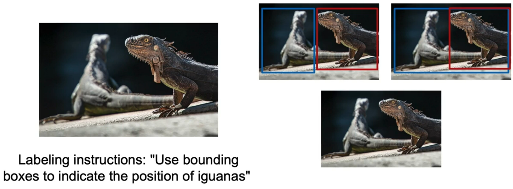
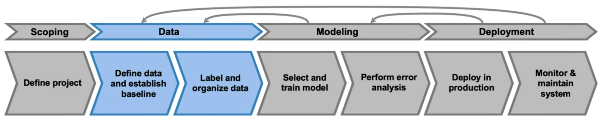
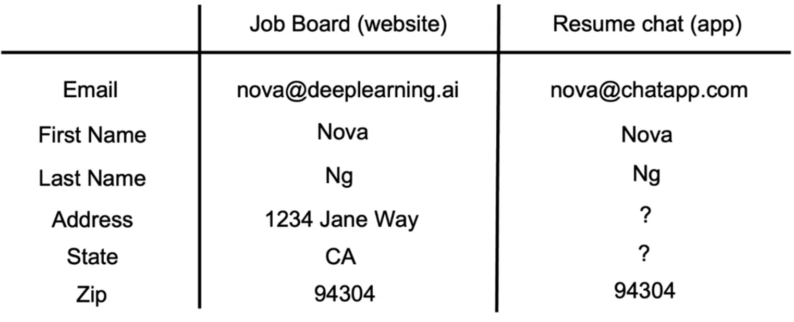
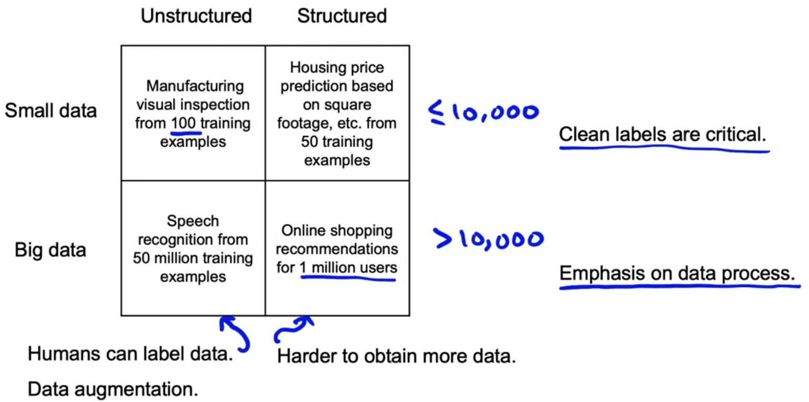
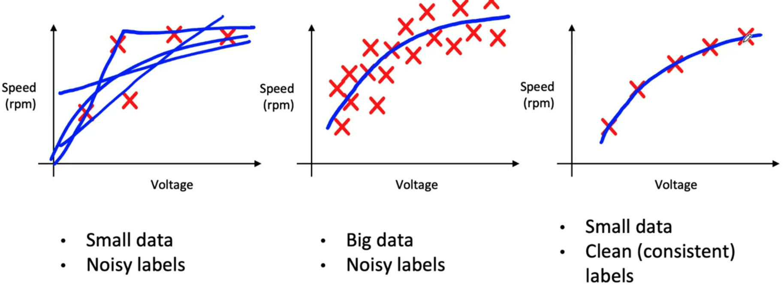
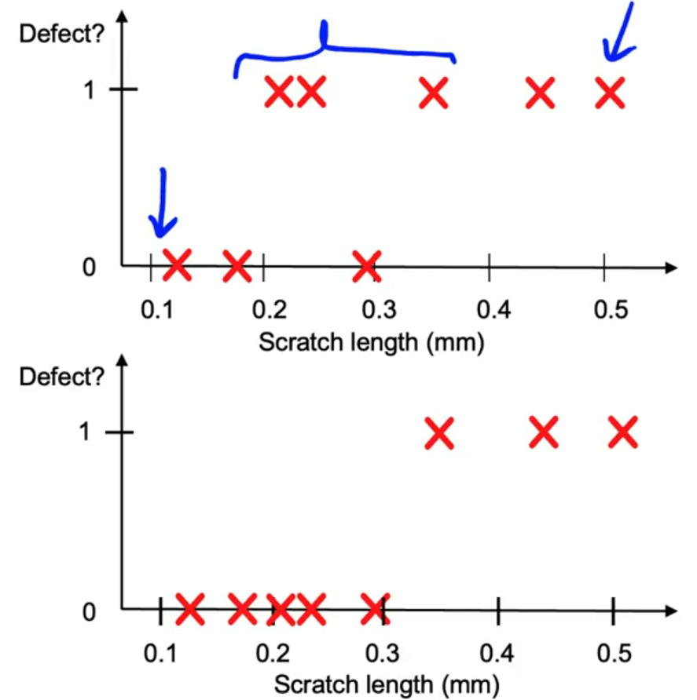
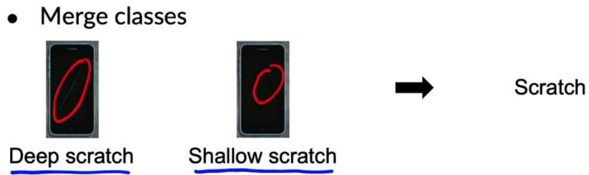
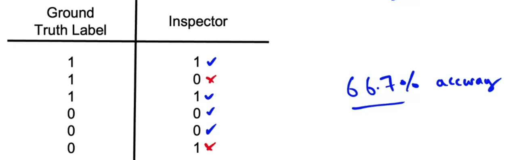

# Data Definition and Baseline

## Define Data and Establish Baseline 

### Why is data definition hard?

#### Detecting iguana example

Three people can come up with three different ways to label the iguanas.

#### Phone defect detection

#### Data stage

In this week, we will dive into best practices for the data stage of the machine learning project.

- How to define what is the data?
- How to label and organize the data well?

### More label ambiguity examples

#### Speech recognition example

An audio clip can be transcribed in different ways:
- "Um, nearest gas station"
- "Umm, nearest gas station"
- "Nearest gas station [unintelligible]"

#### User ID merge example

A common application in many companies is user ID merge, that's when you have multiple records that you think correspond to the same person.

Say you company acquires another company:

Two ways to merge the data:
- Use a supervised approach to say if two users are the same or not based on user attributes, in a scale of 0 to 1. Use instances labelled by users.
- Hire people to manually merge users. Give clear instructions.

#### Data definition questions

- What is the input x?
    - (Phone deffect detection) Is lightning good enough? Contrast? Resolution?
    - (Structured data) What features need to be included?
- What is the target label y?
    - How can we ensure labelers give consistent labels?

### Major types of data problems

The best practices for organizing data for one type can be quite different than the best practices for totally different types.

#### Major types of data problems

 

Unstructured data vs. structured data

- Unstructured data
    - May or may not have huge collection of unlabeled examples x
    - Humans can label more data
    - Data augmentation more likely to be helpful
- Structured data
    - May be more difficult to obtain more data
    - Human labeling may not be possible (with exceptions)

Small data vs. big data

- Small data
    - Clean labels arer critical
    - Can manually look through dataset and fix labels
    - Can get all the lbelers to talk to each other
- Big data
    - Emphasis on data process

### Small data and label consistency

In problems of a small dataset, having clean and consistent labels is especially important. 

When you have a small dataset, five examples and noisy label, it is hard to fit a function confidently. Now, if you have a ton of data, equally noisy as the small data, the learning algorithm can fit a function pretty confidently.

What if you have a small dataset, but clean and consistent labels? In this case, you can confidently fit a function.

#### Phone defect example

When labels are not consisteny, it may be fruitful to ask inspectors to reach an agreement. If the inspectors agree that the point of transition is a length of 0.3mm, it becomes easier to the learning algorithm to consistenly decide if something is a scratch.

#### Big data problems can have small data challenges too

Problems with a large dataset but where there is a *long tail* of rare events in the input will have small data challenges too.
- Web search (small data of rare queries)
- Self-driving cars (small data of rare occurrences)
- Product recommendation systems (small data of interactions with less popular products)

### Improving label consistency

- Have multiple labelers label same example.
- When there is disagreement, have MLE, subject matter expert (SME) and/or labelers discuss definition of _y_ to reach agreement (document that agreement and instructions).
- If labelers believe that x doesn't contain enough information, consider changing x.
- Iterate until it is hard to significantly increase agreement.

#### Standardize labels

Standardize:
- "Um, nearest gas station"
- "Umm, nearest gas station"
- "Nearest gas station"

into 
- "Um, nearest gas station"

#### Merge classes

If the definition of what is a deep or shallow scratch is unclear, merge the classes into a single scratch class. 

#### Have a class/label to capture uncertainty

Supose you ask labelers to label phones as defective or not based on the length of a scratch.

Reaching an agreement is a way to reduce label ambiguity. If that turns out difficult, another option is to create a new class, acknowledging if an example is ambiguous.

- **Defect:** 0, 1 or borderline

If it is possible to create consistent instructions for this three class problem, that could improve label consistency.

Another example is an audio with lots of noise, where it may be better to reach an agreement to label part of the text as [uninteligible].

#### Small data vs. big data (unstructured data)

Small data
- Usually small number of labelers
- You can ask labelers do discuss specific labels

Big data
- Get to consistent definition with a small group
- Then sending labeling instructions to labelers
- Consider using voting to reach a consensus between multiple labelers

In the current machine leaning scenario, there is a lack of tools for assisting labeling and label consistency between a team.

### Human level performance (HLP)

Some machine learning tasks consists of predicting an inherently ambiguous output, and human level performance (HLP) can establish a useful baseline of performance. But HLP is sometimes misuse.

#### Why measure MLP

Estimate bayes error/irreducible error to help with error analysis and prioritization.

If the ground truth label was written by another human, are we measuring what is possible or how well two people agree to each other? When the ground truth label is written by a person, there's a different approach to thinking about HLP.

#### Other uses of HLP

- In academia, establish and beat a respectable benchmark to supportr publication.
- Product owner asks for 99% accuracy. HLP helps establish a more reasonable target.
- "Prove" the ML system is superior to humans doing the job and thus the business or product owner should adopt it (**use with caution**).

#### The problem with beating HLP as a "proof" of ML "superiority"

- **Label 1:** "Um... nearest gas station" (70% of labelers)
- **Label 2:** "Um, nearest gas station" (30% of labelers)

`Two random labelers agree: 0.7² + 0.3² = 0.58`

In the usual way of measuring HLP, you would conclude that HLP is 0.58, but what you're really measuring is the chance of two labelers agree.

This is where the learning algorithm has an unfair advantage. The algorithm is better at gathering statistics of how often commas or ellipses are used in transcriptions

`ML agrees with humans: 0.70`

The 12% performance boost is not important for anything and can mask more significant errors may be making.

### Raising HLP