# Course 2 Week 1: Overview of the ML Lifecycle and Deployment 

## Introduction to Machine Learning Engineering in Production

### Overview

#### The importance of data

*"Data is the hardest part of ML and the most important piece to get right... Broken data is the most common cause of problems in production ML Systems"*

Scaling Machine Learning at Uber with Michelangelo - Uber

*"No other activity in the machine learning lifecycle has a higher return on investment than improving the data a model has access to."*

Feast: Bridging ML Models and Data - Gojek

#### Traditional ML modeling

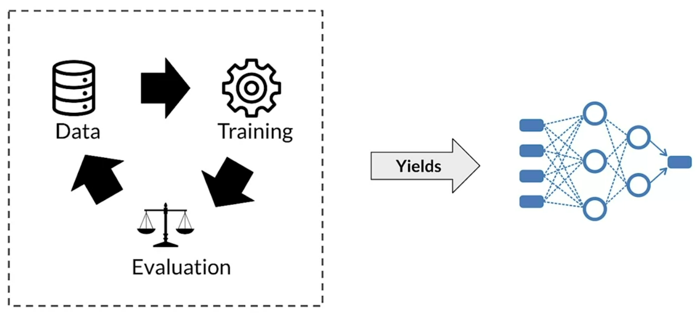

#### Production ML systems require so much more

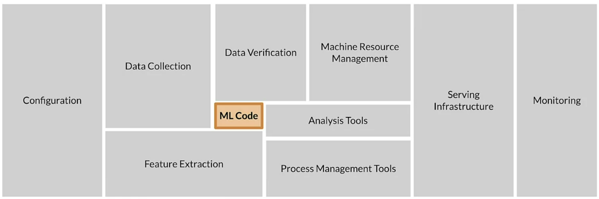

ML code accounts for approximately 5% of the total code.

#### ML modeling vs production ML

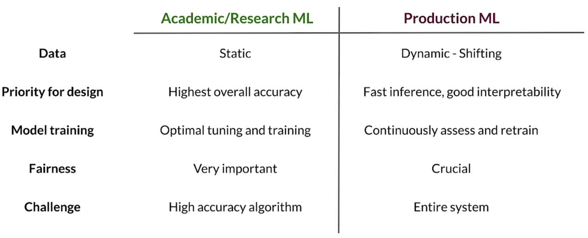

- Production ML = ML development + Modern software development

#### Managing the entire lifecycle of data

- Labeling
- Feature space coverage
- Minimal dimensionality
- Maximum predictive data
- Fairness
- Rare conditions

#### Modern software development

Accounts for:
- Scalability
- Extensibility
- Configuration
- Consistency and reproducibility
- Safety and security
- Modularity
- Testability
- Monitoring
- Best practices

#### Production machine learning system

#### Challenges in production grade ML

- Build integrate systems
- Continuously operate it in production (24/7)
- Handle continuously changing data
- Optimize compute resource costs

### ML Pipelines

#### ML pipelines

Infrastructure for automating, monitoring, and maintaining model training and deployment.

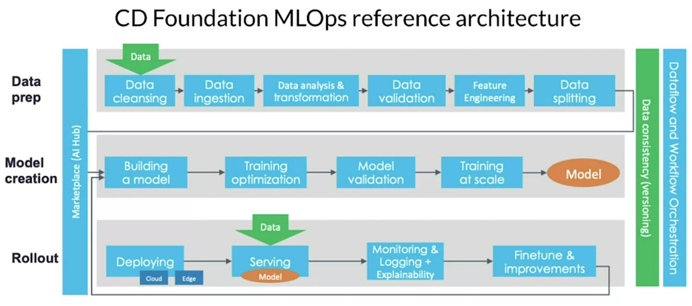

- ML pipeline workflows are usually directed acyclic graphs (DAG).
- A DAG is a directed graph that has no cycles.
- DAGs define the sequencing of the tasks to be performed, based on their relationships and dependencies.

#### Pipeline orcherstration frameworks

- Responsible for scheduling the various components in an ML pipeline DAG dependencies.
- Help with pipeline automation.
- Examples: Airflow, Argo, Celery, Luigi, Kubeflow

#### TensorFlow Extended (TFX)

An end-to-end platform for deploying production ML pipelines.

## Collecting Data

### Importance of Data

In production ML, you usually have to find ways to collect data.

#### Example: predicting time spent on the airport security checkpoint

One person at the start of the line and another one recorded the time each passenger entered or left the line. **Painful!**

#### ML: Data is a First-Class Citizen

-  Software 1.0
    - Explicit instructions to the compute
- Software 2.0
    - Specify some goal on the behavior of a program
    - Find a solution using optimization techniques
    - Good data is key to success
    - Code in Software = Data in ML

#### Everything starts with data

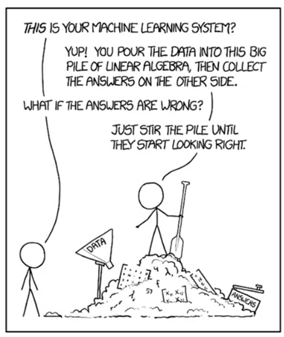

- Models aren't magic
- Meaningful data:
    - Maximize predictive content
    - Remove non-informative data
    - Feature space coverage

#### Garbage In, Garbage Out

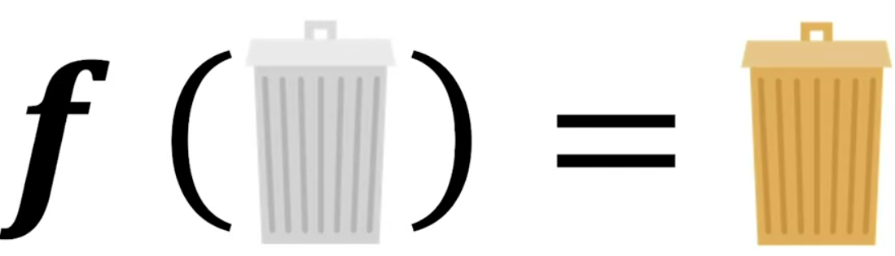

#### Key Points

- Understand users, translate user needs into data problems
- Ensure data coverage and high predictive signal
- Source, store and monitor quality data responsibly

### Example Application: Suggesting Runs

![Garbage In, Garbage Out](figures/course2/week1/suggesting_runs.png

#### key considerations

- Data availability and collection
    - What kind of/how much data is available
    - How often does the new data come in:
    - Is it annotated?
        - If not, how hard/expensive is it to get it labeled?

- Translate user needs into data needs
    - Data needed
    - Features needed
    - Labels needed

#### Example dataset

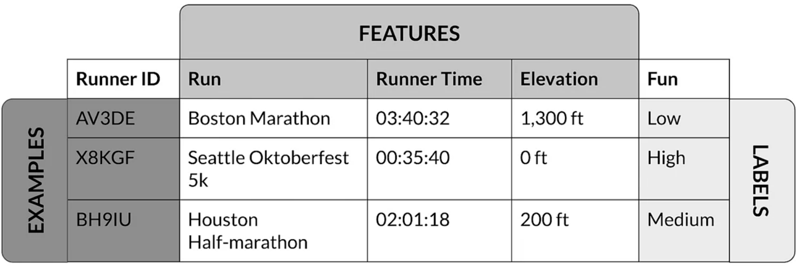

#### Get to know your data

- Identify data sources
- Check if they are refreshed
- Consistency for values, units, and data types
- Monitor outliers and errors

#### Dataset issues

- Inconsistent formatting
    - Is zero "0", "0.0", or an indicator of a missing measurement
- Compounding errors from other ML Models
- Monitor data sources for system issues and outages

#### Measure Data Effectiveness

- Intuition about data value can be misleading
    - Which features have predictive value and which ones do not?
- Feature engineering helps to maximize the predictive signals
- Feature selection helps to measure the predictive signals

#### Translate User Needs Into Data Needs

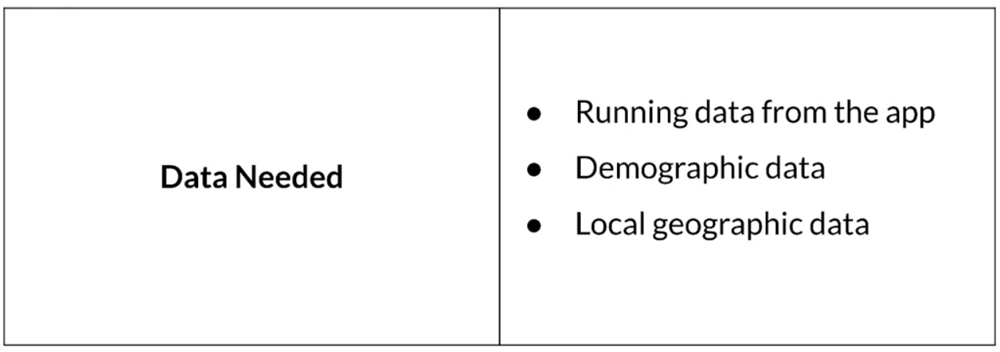

Translate that into features

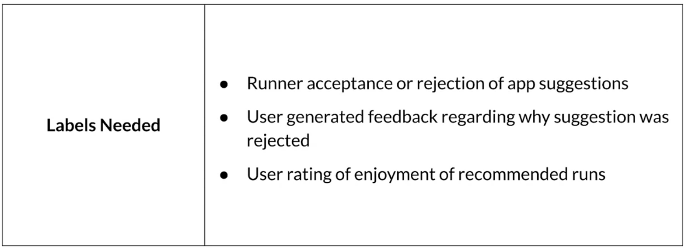

#### Key points

- Understand your user, translate their needs into data problems
    - What kind of/how much data is available
    - What are the details and issues of your data
    - what are your predictive features
    - What are the labels you are tracking
    - What are your metrics

### Responsible Data: Security, Privacy and Fairness

#### Example

A classifier trained on Open Images dataset may not be able to label wedding traditions from different parts of the world.

#### Source Data Responsibly

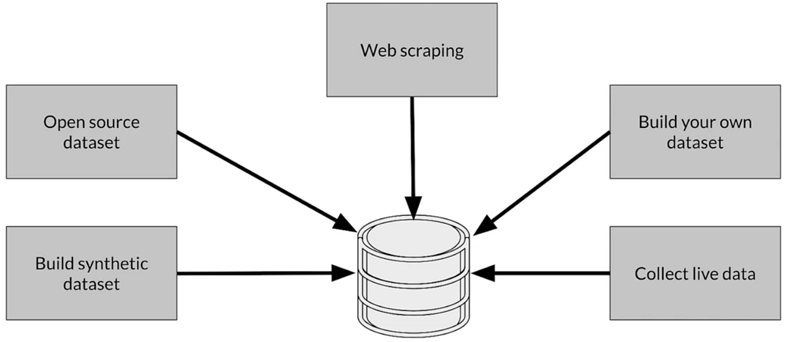

#### Data Security and Privacy

- Data collection and management isn't just about your model
    - Give user control o what data can be collected
    - Is there a risk of inadvertently revealing user data?
- Compliance with regulations and policies

#### Users privacy

- Protect personally identifiable information
    - Aggregation: replace unique values with summary value
    - Redaction: remove some data to create a less complete picture

#### How ML Systems Can Fail Users

- Representational har
- Opportunity denial
- Disproportionate product failure
- Harm by disadvantage

#### Commit to Fairness

- Make sure your models are fair
    - Group fairness, equal accuracy
- Bias in human-labeled and/or collected data
- ML Models can amplify biases

#### Reducing bias: Design fair labeling systems

- Accurate labels are necessary for supervised learning
- Labeling can be done by:
    - Automation (logging or weak supervision)
- Humans (aka "Raters", often semi-supervised)

#### Types of human raters

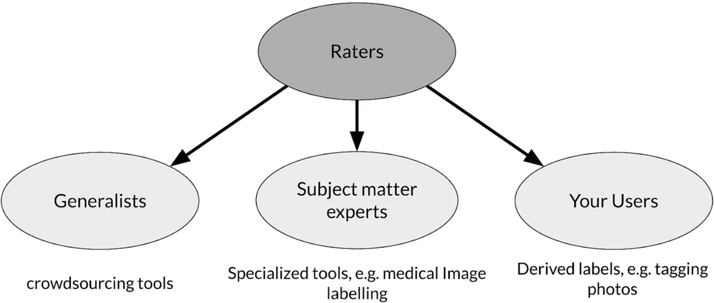

#### Key points

- Ensure rater pool diversity
- Investigate rater context and incentives
- Evaluate rater tools
- Manage cost
- Determine freshness requirements

## Labeling Data

Data is always changing. If you trained a model a few years ago to recognize what a book looks like, it would only consider paper books. If you trained the same model nowadays, you would also want to include ebooks.

### Case Study: Degraded Model Performance

#### You're on an Online Retailer Selling Shoes

Your model predicts click-through rates (CTR), helping you decide how much inventory to order.

**When suddenly** your AUC and prediction accuracy has dropped on men's dress shoes!

- Why?
- How do we even know that we have a problem?

If you don't put good practices in place in the production setting, you're gonna find out when you order too many shoes or not enough shoes.

#### Case study: taking action

- How to detect problems early on?
- What are the possible causes?
- What can be done to solve these?

#### What causes problems?

Kinds of problems:
- Slow problems: e.g., drift
- Fast problems: e.g., bad sensors, bad software update

#### Gradual problems

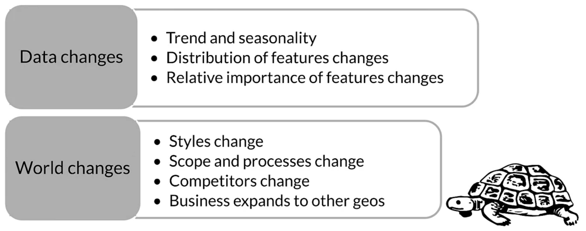

#### Sudden problems

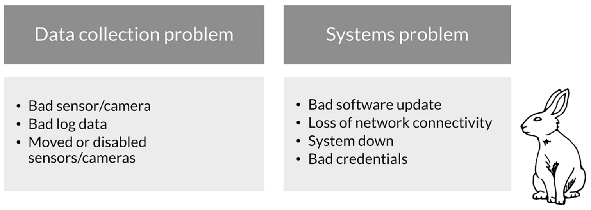

#### Why "understand" the model?

- Mispredictions do not have uniform **cost** to your business
- The **data you have** is rarely the data you wish you had
- Model objective is nearly always a **proxy** for your business objectives
- Some percentage of your customers may have a **bad experience**

**The real world does not stand still**

### Data and Concept Change in Production ML

#### Detecting problems with deployed models

- Data and scope change
- Monitor models and validate data to find problems early
- Changing ground truth: **label** new training data

#### Easy problems

Example: classifying cats and dogs in pictures.

- Ground truth changes slowly (month, years)
- Model retraining driven by:
    - Model improvements, better data
    - Changes in software and/or systems
- Labeling
    - Curated datasets
    - Crowd-based

#### Harder problems

Example: fashion/style applications.

- Ground truth changes fast (weeks)
- Model retraining driven by:
    - **Declining model performance**
    - Model improvements, better data
    - Changes in software and/or systems
- Labeling
    - Direct feedback
    - Crowd-based

#### Really hard problems

Example: stock market applications.

- Ground truth changes very fast (days, hours, min)
- Model retraining driven by:
    - **Declining model performance**
    - Model improvements, better data
    - Changes in software and/or systems
- Labeling
    - Direct feedback
    - Weak supervision

#### Key points

- Model performance decay over time
    - Data and Concept Drift
- Model retraining helps to improve performance
    - Data labeling for changing ground truth and scarce labels

### Process Feedback and Human Labeling

#### Data labeling

Variety of Methods:
- Process Feedback (direct labeling): e.g., actual vs predicted click-through
- Human Labeling: e.g., cardiologists labeling MRI images
- ~~Semi-Supervised Labeling~~
- ~~Active Learning~~
- ~~Weak Supervision~~

We are not going to cover the last ones.

#### Why is labeling important in production ML

In many cases you need to perform supervised learning, therefore requiring labeled data.

- Using business/organization available data
- Frequent model retraining
- Labeling ongoing and critical process
- Creating a training dataset requires labels

#### Direct labeling: continuous creation of training dataset

Features are taken from the inference requests that your model is getting.

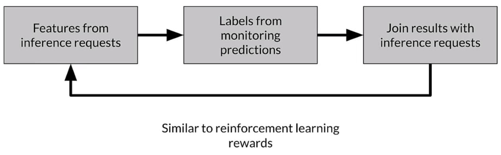

Advantages
- Training dataset continuous creation
- Labels evolve quickly
- Captures strong label signals

Disadvantages
- Hindered by the inherent nature of the problem
- Failure to capture ground truth
- Largely bespoke design

#### Process feedback - Open-Source log analysis tools

**Logstash:** free and open-source data processing pipeline
- Ingests data from a multitude of sources
- Transforms it
- Sends it to your favorite "stash"

**Fluentd**
- Open-source data collector
- Unify the data collection and consumption

#### Process feedback - Cloud log analytics

**Google Cloud Logging**
- Data and events from Google Cloud and AWS
- BindPlane. Logging: application components, on-premise, and hybrid cloud systems
- Sends it to your favorite "stash"

**AWS ElasticSearch**

**Azure Monitor**

#### Human labeling

People ("raters") to examine data and assign labels manually.

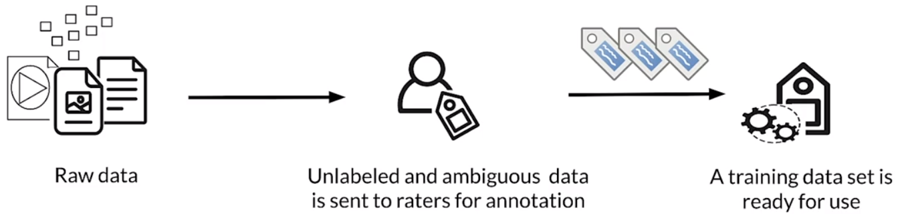

Methodology
1. Unlabeled data is collected
2. Human "raters" are recruited
3. Instructions to guide raters are created
4. Data is divided and assigned to raters
5. Labels are collected and conflicts resolved

Advantages
- More labels
- Pure supervised learning

Disadvantages
- Quality consistency: datasets difficult for human labeling
- It can be slow
- It can be expensive (specialists)
- Small dataset curation

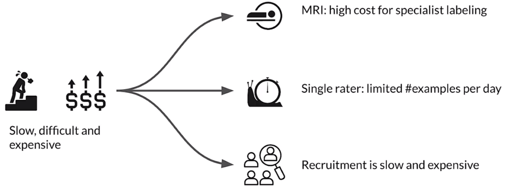

#### Key points

- Various methods of data labeling
    - Process feedback
    - Human labeling
- Advantages and disadvantages of both