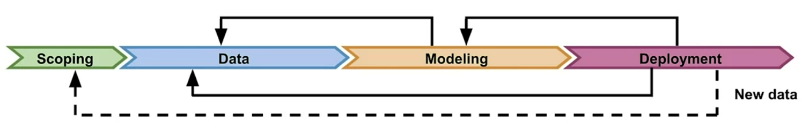
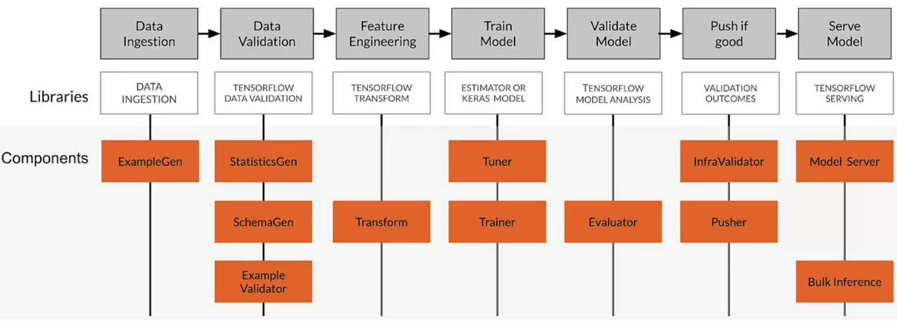
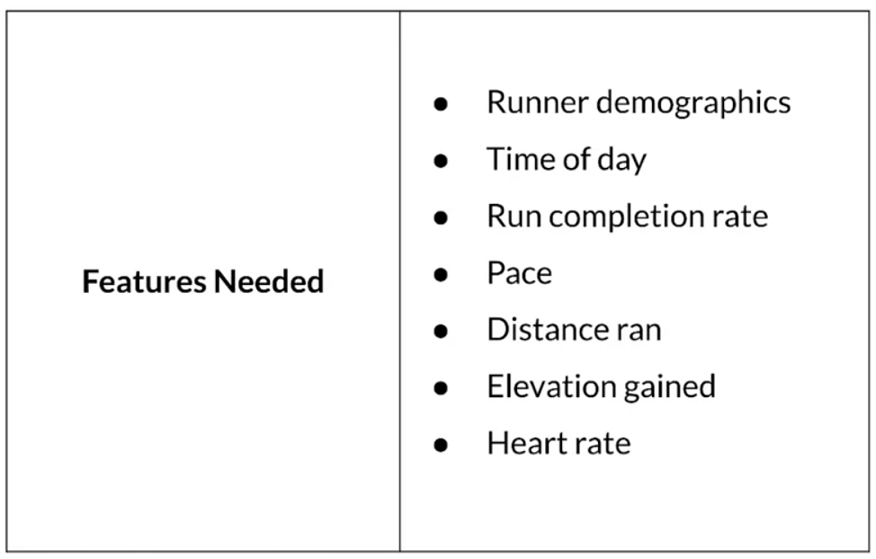

# Course 2 Week 1: Overview of the ML Lifecycle and Deployment 

## Introduction to Machine Learning Engineering in Production

### Overview

#### The importance of data

*"Data is the hardest part of ML and the most important piece to get right... Broken data is the most common cause of problems in production ML Systems"*

Scaling Machine Learning at Uber with Michelangelo - Uber

*"No other activity in the machine learning lifecycle has a higher return on investment than improving the data a model has access to."*

Feast: Bridging ML Models and Data - Gojek

#### Traditional ML modeling

#### Production ML systems require so much more

ML code accounts for approximately 5% of the total code.

#### ML modeling vs production ML

- Production ML = ML development + Modern software development

#### Managing the entire lifecycle of data

- Labeling
- Feature space coverage
- Minimal dimensionality
- Maximum predictive data
- Fairness
- Rare conditions

#### Modern software development

Accounts for:
- Scalability
- Extensibility
- Configuration
- Consistency and reproducibility
- Safety and security
- Modularity
- Testability
- Monitoring
- Best practices

#### Production machine learning system

#### Challenges in production grade ML

- Build integrate systems
- Continuously operate it in production (24/7)
- Handle continuously changing data
- Optimize compute resource costs

### ML Pipelines

#### ML pipelines

Infrastructure for automating, monitoring, and maintaining model training and deployment.

- ML pipeline workflows are usually directed acyclic graphs (DAG).
- A DAG is a directed graph that has no cycles.
- DAGs define the sequencing of the tasks to be performed, based on their relationships and dependencies.

#### Pipeline orcherstration frameworks

- Responsible for scheduling the various components in an ML pipeline DAG dependencies.
- Help with pipeline automation.
- Examples: Airflow, Argo, Celery, Luigi, Kubeflow

#### TensorFlow Extended (TFX)

An end-to-end platform for deploying production ML pipelines.

## Collecting Data

### Importance of Data

In production ML, you usually have to find ways to collect data.

#### Example: predicting time spent on the airport security checkpoint

One person at the start of the line and another one recorded the time each passenger entered or left the line. **Painful!**

#### ML: Data is a First-Class Citizen

-  Software 1.0
    - Explicit instructions to the compute
- Software 2.0
    - Specify some goal on the behavior of a program
    - Find a solution using optimization techniques
    - Good data is key to success
    - Code in Software = Data in ML

#### Everything starts with data

- Models aren't magic
- Meaningful data:
    - Maximize predictive content
    - Remove non-informative data
    - Feature space coverage

#### Garbage In, Garbage Out

#### Key Points

- Understand users, translate user needs into data problems
- Ensure data coverage and high predictive signal
- Source, store and monitor quality data responsibly

### Example Application: Suggesting Runs

![Garbage In, Garbage Out](figures/course2/week1/suggesting_runs.png

#### key considerations

- Data availability and collection
    - What kind of/how much data is available
    - How often does the new data come in:
    - Is it annotated?
        - If not, how hard/expensive is it to get it labeled?

- Translate user needs into data needs
    - Data needed
    - Features needed
    - Labels needed

#### Example dataset

#### Get to know your data

- Identify data sources
- Check if they are refreshed
- Consistency for values, units, and data types
- Monitor outliers and errors

#### Dataset issues

- Inconsistent formatting
    - Is zero "0", "0.0", or an indicator of a missing measurement
- Compounding errors from other ML Models
- Monitor data sources for system issues and outages

#### Measure Data Effectiveness

- Intuition about data value can be misleading
    - Which features have predictive value and which ones do not?
- Feature engineering helps to maximize the predictive signals
- Feature selection helps to measure the predictive signals

#### Translate User Needs Into Data Needs

Translate that into features

#### Key points

- Understand your user, translate their needs into data problems
    - What kind of/how much data is available
    - What are the details and issues of your data
    - what are your predictive features
    - What are the labels you are tracking
    - What are your metrics

### Responsible Data: Security, Privacy and Fairness

#### Example

A classifier trained on Open Images dataset may not be able to label wedding traditions from different parts of the world.

#### Source Data Responsibly

#### Data Security and Privacy

- Data collection and management isn't just about your model
    - Give user control o what data can be collected
    - Is there a risk of inadvertently revealing user data?
- Compliance with regulations and policies

#### Users privacy

- Protect personally identifiable information
    - Aggregation: replace unique values with summary value
    - Redaction: remove some data to create a less complete picture

#### How ML Systems Can Fail Users

- Representational har
- Opportunity denial
- Disproportionate product failure
- Harm by disadvantage

#### Commit to Fairness

- Make sure your models are fair
    - Group fairness, equal accuracy
- Bias in human-labeled and/or collected data
- ML Models can amplify biases

#### Reducing bias: Design fair labeling systems

- Accurate labels are necessary for supervised learning
- Labeling can be done by:
    - Automation (logging or weak supervision)
- Humans (aka "Raters", often semi-supervised)

#### Types of human raters

#### Key points

- Ensure rater pool diversity
- Investigate rater context and incentives
- Evaluate rater tools
- Manage cost
- Determine freshness requirements