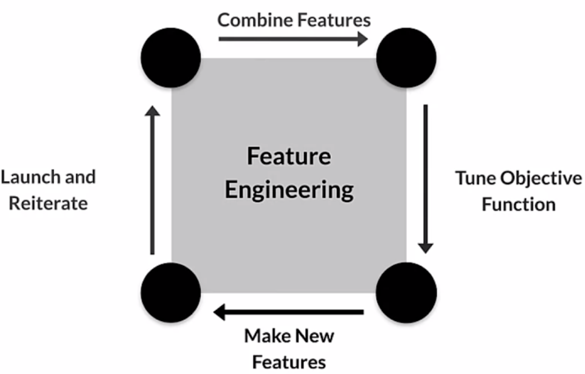
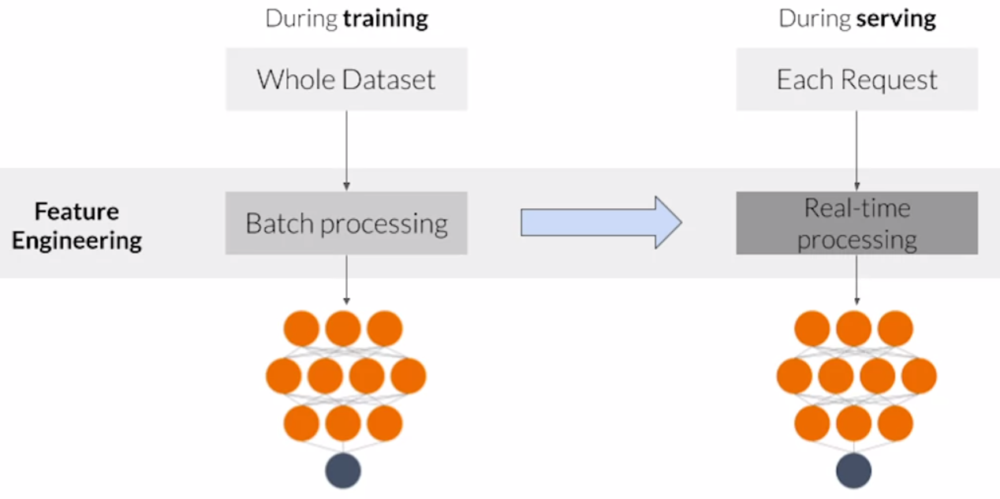

# Course 2 Week 2: Feature Engineering, Transformation and Selection

## Introduction to Preprocessing

### Squeezing the most out of data

- Making data useful before training a model
- Representing data in forms that help models learn
- Increasing predictive quality
- Reducing dimensionality with feature Engineering

#### Art of feature engineering

#### Typical ML pipeline

Ensure that the preprocessing during serving is the same as during training.

#### Key points

- Feature engineering can be difficult and time consuming, but also very important to success
- Squeezing the most out of data through feature engineering enables models to learn better
- Concentrating predictive information in fewer features enables more efficient use of compute resources
- Feature engineering during training must also be applied correctly during serving