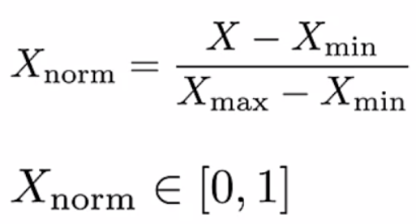
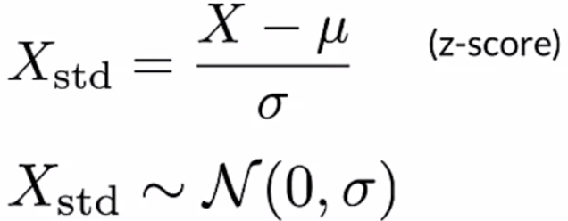
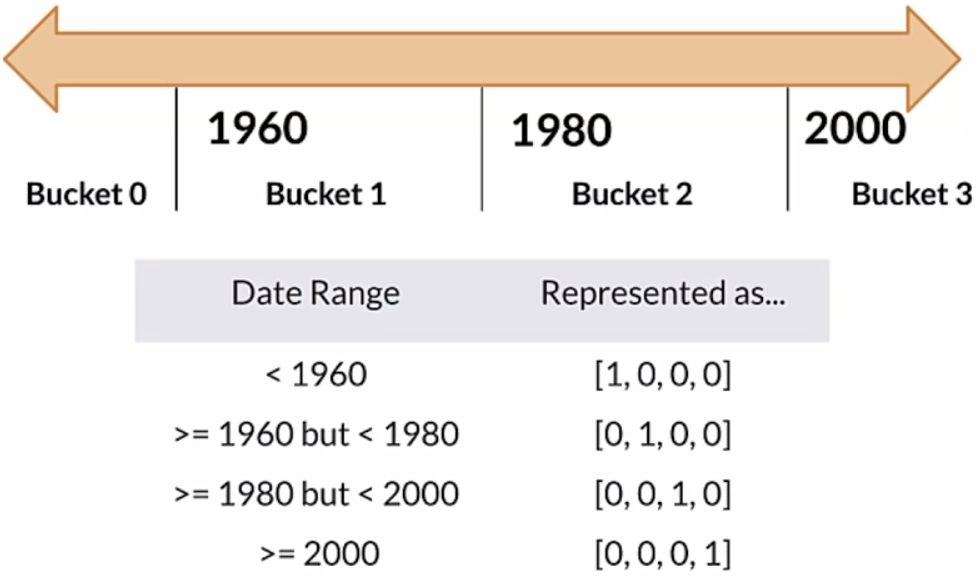

# Course 2 Week 2: Feature Engineering, Transformation, and Selection

## Introduction to Preprocessing

### Squeezing the most out of data

- Making data useful before training a model
- Representing data in forms that help models learn
- Increasing predictive quality
- Reducing dimensionality with feature Engineering

#### Art of feature engineering

#### Typical ML pipeline

Ensure that the preprocessing during serving is the same as during training.

#### Key points

- Feature engineering can be difficult and time-consuming, but also very important to the success
- Squeezing the most out of data through feature engineering enables models to learn better
- Concentrating predictive information in fewer features enables more efficient use of computing resources
- Feature engineering during training must also be applied correctly during serving

### Preprocessing Operations

#### Main preprocessing operations

- Data cleansing: correcting erroneous data
- Feature tuning: scaling, normalization.
- Representation transformation
- Featuring extraction: creating lower dimension, more robust data representation
- Feature construction: creating new features

#### Mapping raw data into features

#### Mapping categorical values

#### Categorical Vocabulary

#### Empirical knowledge of data

You also know something about your data or working with data.

- **Text:** stemming, lemmatization, TF-IDF, n-grams, embedding lookup
- **Images**: clipping, resizing, cropping, blur, canny filters, Sobel filters, photometric distortions

#### Key points

- Data preprocessing: transforms raw data into a clean and training-ready dataset
- Feature engineering maps:
    - Raw data into feature vectors
    - Integer values to floating-point values
    - Normalizes numerical values
    - Strings and categorical values to vectors of numeric values
    - Data from one space into a different space

### Feature Engineering Techniques

#### Feature Engineering Techniques

Numerical range:
- Scaling
- Normalizing
- Standardizing

Grouping
- Bucketing
- Bag of words

Very dependent on the particular algorithm you are going to use.

#### Scaling

- Converts values from their natural range into a prescribed range
    - E.g. grayscale image pixel intensity scale is [0, 255] usually rescaled to [-1, 1]
- Benefits
    - Helps neural nets converge faster
    - Do away with NaN errors during training
    - For each feature, the model learns the right weights

#### Normalization

Useful if you don't know if the distribution of your data is gaussian.

#### Standardization (z-score)

- Z-score relates the number of standard deviations away from the mean

Try both normalization and standardization and compare the results.

#### Bucketizing/Binning

#### Other techniques

Dimensionality reduction in embeddings
- Principal component analysis (PCA)
- t-distributed stochastic neighbor embedding (t-SNE)
- Uniform manifold approximation and projection (UMAP)

Featuring crossing

#### TensorFlow embedding projector

- Intuitive exploration of high-dimensional data
- Visualize and analyze
- Techniques
    - PCA
    - t-SNE
    - UMAP
    - Custom linear projections
- Ready to play

#### Key points

- Feature engineering:
    - Prepares, tunes, transforms, extracts, and constructs features
- Feature engineering is key for model refinement
- Feature engineering helps with ML analysis

### Feature Crosses

#### Feature Crosses

- Combines multiple features into a new feature
- Encodes nonlinearity in the feature space, or encodes the same information in fewer features

We can create many different kinds of features crosses:
- [A x B] multiplying the values of two features
- [A x B x C x D x E] multiplying the values of 5 features
- [Day of week, Hour] -> Hour of the week (feature with semantic sense)

#### Key points

- Featuring crossing: synthetic featuring encoding nonlinearity in feature space
- Feature coding: transforming categorical to a continuous variable