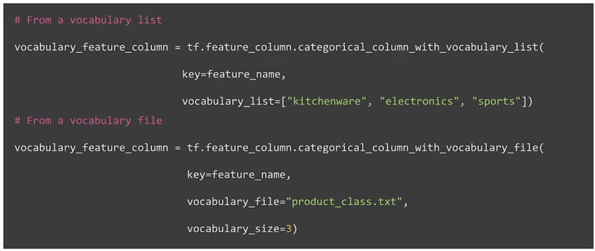

# Course 2 Week 2: Feature Engineering, Transformation and Selection

## Introduction to Preprocessing

### Squeezing the most out of data

- Making data useful before training a model
- Representing data in forms that help models learn
- Increasing predictive quality
- Reducing dimensionality with feature Engineering

#### Art of feature engineering

#### Typical ML pipeline

Ensure that the preprocessing during serving is the same as during training.

#### Key points

- Feature engineering can be difficult and time consuming, but also very important to success
- Squeezing the most out of data through feature engineering enables models to learn better
- Concentrating predictive information in fewer features enables more efficient use of compute resources
- Feature engineering during training must also be applied correctly during serving

### Preprocessing Operations

#### Main preprocessing operations

- Data cleansing: correcting erroneous data
- Feature tuning: scaling, normalization.
- Representation transformation
- Featuring extraction: creating lower dimension, more robust data representation
- Feature construction: creating new features

#### Mapping raw data into features

#### Mapping categorical values

#### Categorical Vocabulary

#### Empirical knowledge of data

You also know something about your data or working with data.

- **Text:** stemming, lemmatization, TF-IDF, n-grams, embedding lookup
- **Images**: clipping, resizing, cropping, blur, canny filters, sobel filters, photometric distortions

#### Key points

- Data preprocessing: transforms raw data into a clean and training-ready dataset
- Feature engineering maps:
    - Raw data into feature vectors
    - Integer values to floating-point values
    - Normalizese numerical values
    - Strings and categorical values to vectors of numeric values
    - Data from one space into a different space

### Feature Engineering Techniques

### Feature Crosses